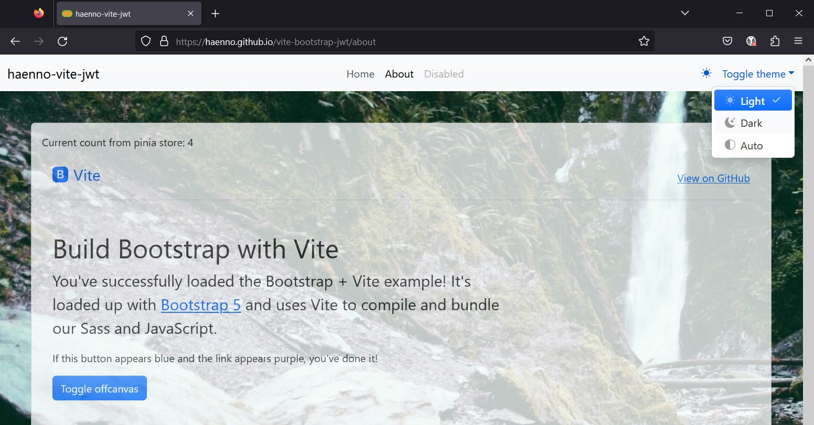
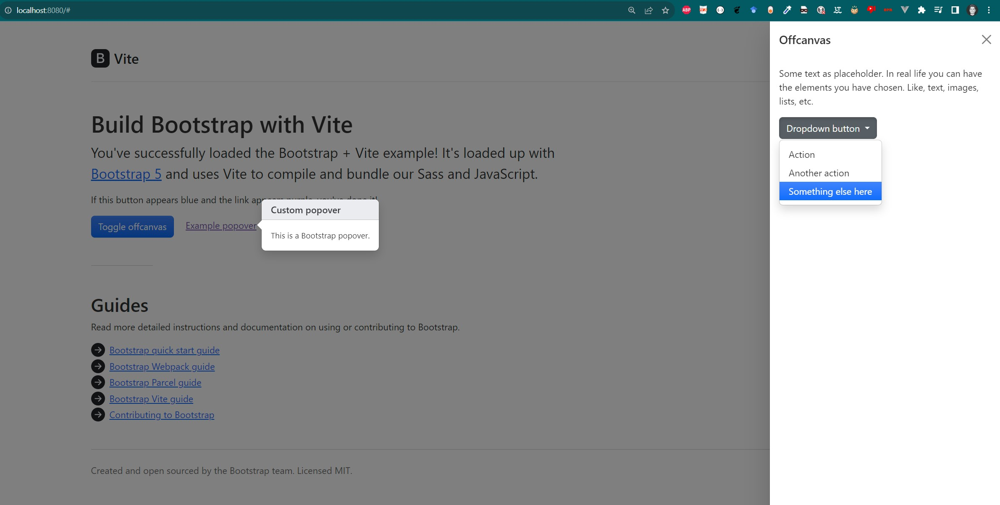

# vite-bootstrap-frontend-for-Django-rest-framework-simple-jwt
A frontend build with Vite and Bootstrap for a backend with Django REST framework and Simple JWT.

**This project is uncomplete and still a work in progress.**

A live working **demo** is available at <https://haenno.github.io/vite-bootstrap-jwt/>.

## Todo-List

- [x] Setup Vite and Bootstrap
- [x] Create a CI/CD pipeline with GitHub Actions
- [x] Setup automatic deployment to GitHub Pages
- [ ] Add axios
- [ ] Implement a sample API call
- [ ] and more...

## Lifecycle

- 2023-08-10: Darkmode selector and background image added

- 2023-08-08: Provided template site with some Bootstrap examples 

## Note to repo initialisation

This repo was initialised by following the instructions from <https://getbootstrap.com/docs/5.2/getting-started/vite/> and cloning the repo from <https://github.com/twbs/examples/tree/main/vite>.
